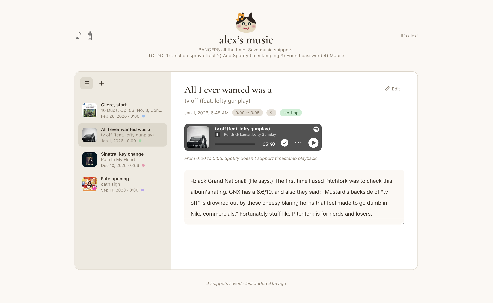

# Music Snippet Saver

Save bits of songs with notes from YouTube or Spotify. Auto-play from start to end timestamps on YouTube and Spotify (Spotify Premium required).



## Usage

1. Sign up or sign in
2. Click **+** and paste a YouTube or Spotify URL
3. Enter timestamp(s) and notes
4. Scroll through your other snippets
5. For Spotify snippets: click **Connect Spotify** then **Play snippet** for timestamp playback (Premium required)

## Quick Start

```bash
npm install
npm run dev
```

Open http://127.0.0.1:5173 (Spotify redirect requires 127.0.0.1)

## Firebase Setup

1. Create a project at [Firebase Console](https://console.firebase.google.com)
2. Enable **Firestore** and **Authentication** (Email/Password)
3. Add a Web app and copy the config into `frontend/src/firebase.js`

## Spotify Timestamp Playback (optional)

Requires Spotify Premium. For play-from/to timestamp support:

1. Create an app at [Spotify Developer Dashboard](https://developer.spotify.com/dashboard)
2. Add redirect URI: `http://127.0.0.1:5173` (dev) and your production URL
3. Copy Client ID into `frontend/.env`: `VITE_SPOTIFY_CLIENT_ID=your_client_id`

## Deploy

```bash
npm run deploy
```

## Tech

React + Vite · Firestore · Firebase Auth & Hosting